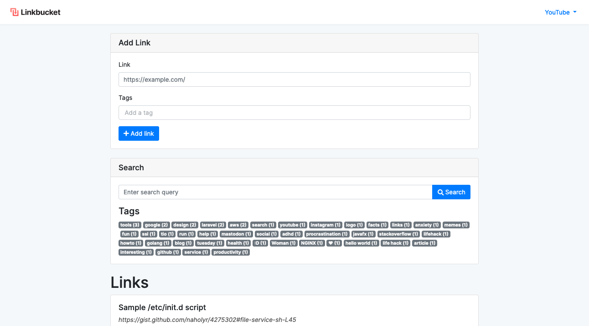

Linkbucket is a free and open-source online bookmark manager focused on simplicity and minimalism. It is written in Go and React and it is totally self-hostable, so you can run your own instance.



# Installation

## Requirements
+ Go 1.13+
+ NodeJS
+ NPM
+ MySQL

## Commands
```sh
cd client
cp env.example .env
emacs .env # fill variables
npm install
npm run build

cd ../server
cp env.example .env
emacs .env #fill variables
go install
go run .
```

# Licence (AGPLv3)
```
This program is free software: you can redistribute it and/or modify
it under the terms of the GNU Affero General Public License as
published by the Free Software Foundation, either version 3 of the
License, or (at your option) any later version.

This program is distributed in the hope that it will be useful,
but WITHOUT ANY WARRANTY; without even the implied warranty of
MERCHANTABILITY or FITNESS FOR A PARTICULAR PURPOSE.  See the
GNU Affero General Public License for more details.

You should have received a copy of the GNU Affero General Public License
along with this program.  If not, see <https://www.gnu.org/licenses/>.
```