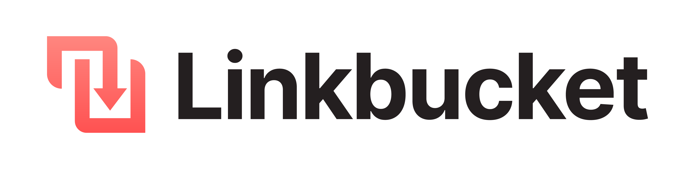
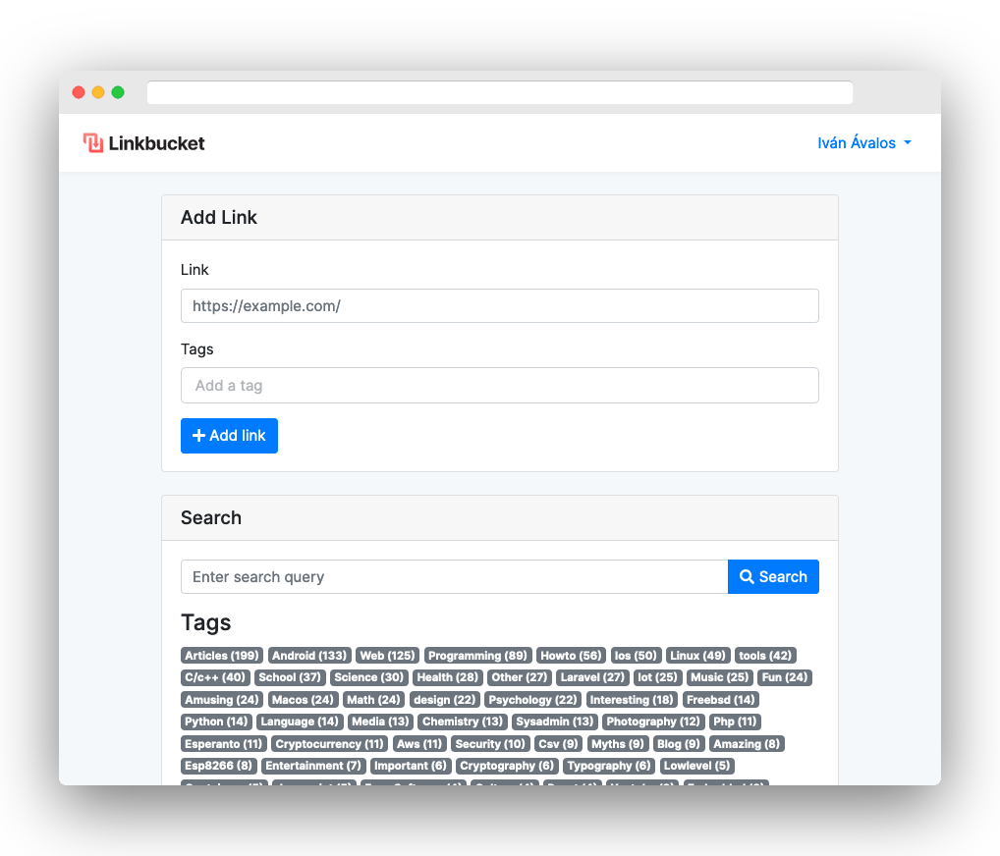

Linkbucket is a free and open-source online bookmark manager focused on simplicity and minimalism. It is written in Go and React and it is totally self-hostable, so you can run your own instance.

### Warning: This software is still in progress and probably not suitable for production yet!




# Installation

## Requirements
+ Go 1.13+
+ NodeJS
+ NPM
+ MySQL

## Commands
```sh
cd client
cp env.example .env
emacs .env # fill variables
npm install
npm run build

cd ../server
cp env.example .env
emacs .env #fill variables
go install
go run .
```

## Build and run using Docker

### Dockerhub
```sh
docker pull avalos/linkbucket-go
wget -O .env.docker https://raw.githubusercontent.com/ivan-avalos/linkbucket-go/master/env.docker.example
emacs .env.docker # fill variables
docker run -p 8080:8000 \
	--env-file .env.docker avalos/linkbucket-go
```

### Build image from Dockerfile
```sh
docker build -t TAG_NAME .
cp env.docker.example .env.docker
emacs .env.docker # fill variables
docker run -p 8080:8000 \
	--env-file .env.docker TAG_NAME
```

# History

Linkbucket Go is a full rewrite of the original [Linkbucket](https://github.com/ivan-avalos/linkbucket), written entirely in Laravel (PHP). It preserves its minimalist and basic UI. I created both Linkbuckets only as practice projects (like everything I do), and hence their poor code quality and terrible APIs. But I'm always getting slightly better at programming!

# Licence (AGPLv3)
```
This program is free software: you can redistribute it and/or modify
it under the terms of the GNU Affero General Public License as
published by the Free Software Foundation, either version 3 of the
License, or (at your option) any later version.

This program is distributed in the hope that it will be useful,
but WITHOUT ANY WARRANTY; without even the implied warranty of
MERCHANTABILITY or FITNESS FOR A PARTICULAR PURPOSE.  See the
GNU Affero General Public License for more details.

You should have received a copy of the GNU Affero General Public License
along with this program.  If not, see <https://www.gnu.org/licenses/>.
```
